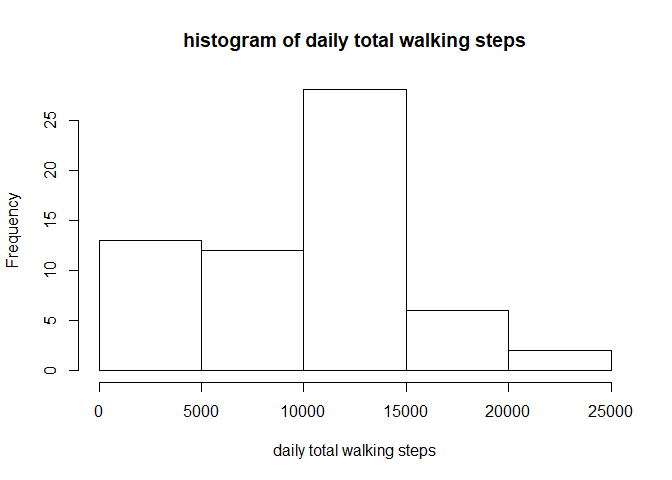
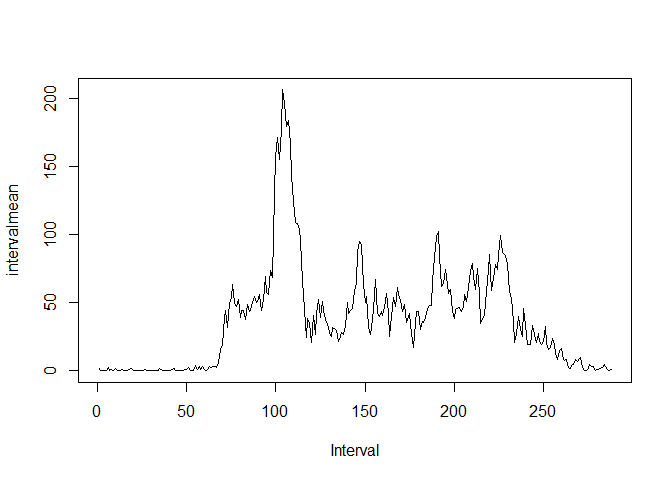
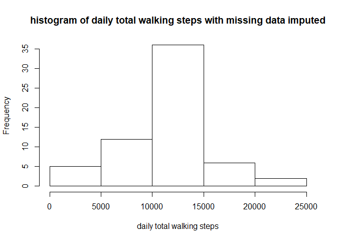
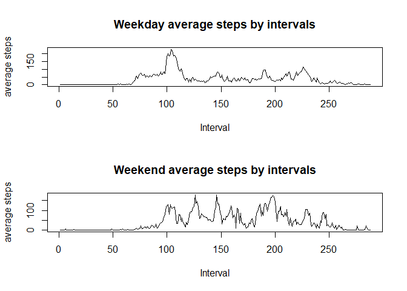

## Loading and preprocessing the data


```r
setwd("C:/Users/Yi Yu/Desktop/cs/datascience/dataclearning/data/repdata_data_activity")
activity<-read.csv("activity.csv")
```


## What is mean total number of steps taken per day?

```r
daily <- tapply(activity$steps, activity$date, sum, na.rm=T)
hist(daily,xlab="daily total walking steps",main="histogram of daily total walking steps")
```

<!-- -->

```r
dailymean<-tapply(activity$steps,activity$date,mean,na.rm=T)
dailymedian<-tapply(activity$steps,activity$date,mean,na.rm=T)
```
## What is the average daily activity pattern?


```r
intervalmean<-tapply(activity$steps,activity$interval,mean,na.rm=T)
plot(intervalmean,type="l", xlab = "Interval")
```

<!-- -->

```r
intervalmean[which.max(intervalmean)]
```

```
##      835 
## 206.1698
```
## Imputing missing values

```r
sum(is.na(activity))
```

```
## [1] 2304
```

```r
df0 <- as.data.frame.table(intervalmean)
activity2<-activity
for (i in 1:nrow(activity)){
  if (is.na(activity$steps[i])){
    v<-subset(df0,df0$Var1==activity$interval[i])
    activity2$steps[i]=v$Freq
  }}

daily2 <- tapply(activity2$steps, activity2$date, sum)
hist(daily2,xlab="daily total walking steps",main="histogram of daily total walking steps with missing data imputed")
```

<!-- -->

```r
dailymean2<-tapply(activity2$steps,activity2$date,mean)
dailymedian2<-tapply(activity2$steps,activity2$date,mean)
```

## Are there differences in activity patterns between weekdays and weekends?

```r
activity2$date<-as.Date(activity2$date)
activity2$weekday<-weekdays(activity2$date)

activity3<-activity2
for (i in 1:nrow(activity2)){
  if (activity2$weekday[i]=="Saturday"){
    activity3$weekday[i]="Weekend"}
  else if (activity2$weekday[i]=="Sunday"){
    activity3$weekday[i]="weekend"
  }
  else{
    activity3$weekday[i]="weekday"
  }
  }


weekend<-subset(activity3,activity3$weekday=="weekend")
weekday<-subset(activity3,activity3$weekday=="weekday")

par(mfrow=c(2,1))
weekdaymean<-tapply(weekday$steps,weekday$interval,mean)
plot(weekdaymean,type="l", xlab = "Interval",ylab="average steps",main="Weekday average steps by intervals")
weekendmean<-tapply(weekend$steps,weekend$interval,mean)
plot(weekendmean,type="l", xlab = "Interval",ylab="average steps",main="Weekend average steps by intervals")
```

<!-- -->


